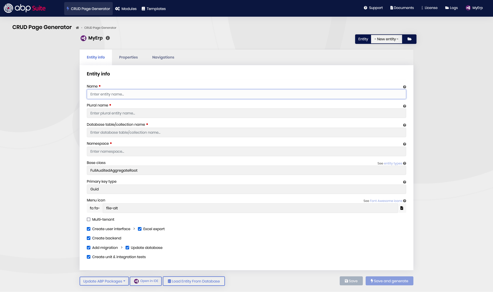
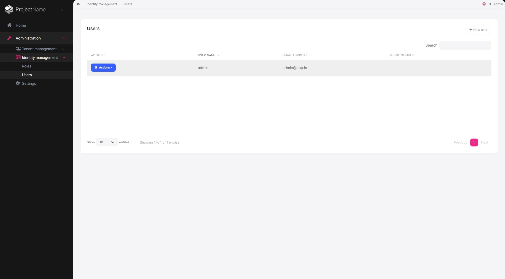
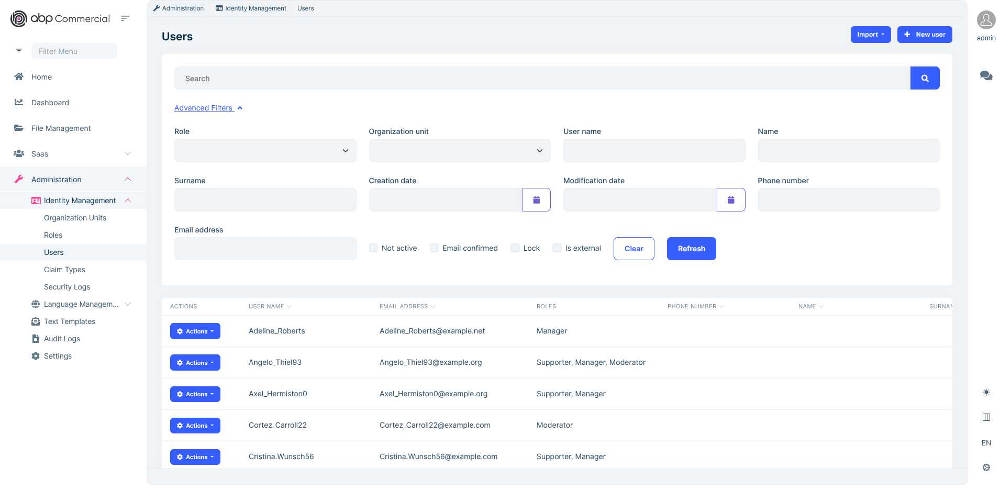

# ABP Framework vs ABP Commercial

**ABP.IO Platform** consists of the open-source ABP Framework and the ABP Commercial.

## Introduction

[ABP Framework](https://abp.io) is a completely free, open-source and community-driven project. It provides a base framework, [startup templates](https://docs.abp.io/en/abp/latest/Startup-Templates/Index), [CLI](https://docs.abp.io/en/abp/latest/CLI), theme called [LeptonX Lite](https://docs.abp.io/en/abp/latest/Themes/LeptonXLite/AspNetCore) and ready to use [application modules](https://docs.abp.io/en/abp/latest/Modules/Index). 

[ABP Commercial](https://commercial.abp.io) adds important benefits on top of the open-source ABP framework with a set of professional [application modules](https://commercial.abp.io/modules), [UI themes](https://commercial.abp.io/themes), CRUD page generator: [ABP Suite](https://commercial.abp.io/tools/suite), [premium support](https://commercial.abp.io/support) and [additional services](https://commercial.abp.io/additional-services). 

> This document only focuses the major differences between the ABP Framework and the ABP Commercial. It only covers some of the features.


## Overall

The following table explains the major differences between the open-source ABP Framework and the ABP Commercial version.

|                                                              | Open Source ABP Framework Project          | ABP Commercial                               |
| ------------------------------------------------------------ | ------------------------------------------ | -------------------------------------------- |
| [Base framework](https://github.com/abpframework/abp/)       | <i class="fa fa-check text-success"></i>   | <i class="fa fa-check text-success"></i>     |
| [Free startup templates](https://docs.abp.io/en/abp/latest/Startup-Templates/Index) | <i class="fa fa-check text-success"></i>   | <i class="fa fa-check text-success"></i>     |
| [Free (basic) application modules](https://docs.abp.io/en/abp/latest/Modules/Index) | <i class="fa fa-check text-success"></i>   | <i class="fa fa-check text-success"></i>     |
| [Free (basic) UI theme](https://docs.abp.io/en/abp/latest/Themes/Basic) | <i class="fa fa-check text-success"></i>   | <i class="fa fa-check text-success"></i>     |
| [ABP CLI](https://docs.abp.io/en/abp/latest/CLI) (Command Line Interface) | <i class="fa fa-check text-success"></i>   | <i class="fa fa-check text-success"></i>     |
| [Community support](https://stackoverflow.com/questions/tagged/abp) | <i class="fa fa-check text-success"></i>   | <i class="fa fa-check text-success"></i>     |
| [PRO startup templates](https://commercial.abp.io/startup-templates) | <i class="fa fa-minus text-secondary"></i> | <i class="fa fa-check text-success"></i>     |
| [PRO application modules](https://commercial.abp.io/modules) | <i class="fa fa-minus text-secondary"></i> | <i class="fa fa-check text-success"></i>     |
| [PRO UI themes](https://commercial.abp.io/themes)            | <i class="fa fa-minus text-secondary"></i> | <i class="fa fa-check text-success"></i>     |
| [ABP Suite](https://commercial.abp.io/tools/suite)           | <i class="fa fa-minus text-secondary"></i> | <i class="fa fa-check text-success"></i>     |
| [Premium support](https://commercial.abp.io/support)         | <i class="fa fa-minus text-secondary"></i> | <i class="fa fa-check text-success"></i>     |
|                                                              | [Download](https://abp.io/get-started)     | [Pricing](https://commercial.abp.io/pricing) |


## The Framework

**The ABP Framework** is completely open-source and developed in a community-driven manner. While it is mainly developed and maintained by the [Volosoft](https://volosoft.com/) Team, it is [getting contributions](https://github.com/abpframework/abp/graphs/contributors) from all over the world. It will always remain open-source and free.

**The ABP Commercial** is not a replacement for the ABP Framework. It directly uses the ABP Framework under the hood and adds some benefits on top of it, which are described in this document.


## Startup Templates

Startup Templates are pre-built and configured solution templates that you can easily kick start your new project.

| Template Type | Open Source ABP Framework Project          | ABP Commercial                           |
| --------------------- | ------------------------------------------ | ---------------------------------------- |
| Application <sup>[1]</sup> | <i class="fa fa-check text-success"></i>   | <i class="fa fa-check text-success"></i> |
| Module / Service      | <i class="fa fa-check text-success"></i>   | <i class="fa fa-check text-success"></i> |
| Microservice Solution | <i class="fa fa-minus text-secondary"></i> | <i class="fa fa-check text-success"></i> |

<sup>[1]</sup> ABP Commercial application startup template has some additional features, like public website and separate tenant database schema support.

>**Open source** startup templates use the **open-source LeptonX Lite theme and free modules** while **ABP Commercial** startup templates use the **PRO modules and themes**.


## Modules

ABP Commercial has many **additional modules** compared to the open-source ABP Framework project. Also, some modules have commercial versions with more features. The table below shows the list of module differences overall:

| Module                                                       | Open Source ABP Framework Project                            | ABP Commercial                                             |
| ------------------------------------------------------------ | ------------------------------------------------------------ | ---------------------------------------------------------- |
| Identity                                                     | [Basic](https://docs.abp.io/en/abp/latest/Modules/Identity)  | [PRO](https://commercial.abp.io/modules/Volo.Identity.Pro) |
| Account                                                      | [Basic](https://docs.abp.io/en/abp/latest/Modules/Account)   | [PRO](https://commercial.abp.io/modules/Volo.Account.Pro)  |
| Multi-Tenancy                                                | [Basic](https://docs.abp.io/en/abp/latest/Modules/Tenant-Management) *(only tenant management)* | [PRO](https://commercial.abp.io/modules/Volo.Saas) (SaaS)  |
| CMS Kit                                                      | [Basic](https://docs.abp.io/en/abp/latest/Modules/Cms-Kit)   | [PRO](https://commercial.abp.io/modules/Volo.CmsKit.Pro)   |
| [Blogging](https://docs.abp.io/en/abp/latest/Modules/Blogging) | <i class="fa fa-check text-success"></i>                     | <i class="fa fa-check text-success"></i>                   |
| [Docs](https://docs.abp.io/en/abp/latest/Modules/Docs)       | <i class="fa fa-check text-success"></i>                     | <i class="fa fa-check text-success"></i>                   |
| [Identity Server Integration](https://docs.abp.io/en/abp/latest/Modules/IdentityServer) | <i class="fa fa-check text-success"></i>                     | <i class="fa fa-check text-success"></i>                   |
| [Identity Server Management UI](https://commercial.abp.io/modules/Volo.Identityserver.Ui) | <i class="fa fa-minus text-secondary"></i>                   | <i class="fa fa-check text-success"></i>                   |
| [OpenIddict Integration](https://docs.abp.io/en/abp/latest/Modules/OpenIddict) | <i class="fa fa-check text-success"></i>                     | <i class="fa fa-check text-success"></i>                   |
| [OpenIddictManagement UI](https://commercial.abp.io/modules/Volo.OpenIddict.Pro) | <i class="fa fa-minus text-secondary"></i>                   | <i class="fa fa-check text-success"></i>                   |
| [Audit Log Reporting UI](https://commercial.abp.io/modules/Volo.AuditLogging.Ui) | <i class="fa fa-minus text-secondary"></i>                   | <i class="fa fa-check text-success"></i>                   |
| [Dynamic Language Management](https://commercial.abp.io/modules/Volo.LanguageManagement) | <i class="fa fa-minus text-secondary"></i>                   | <i class="fa fa-check text-success"></i>                   |
| [Payment](https://commercial.abp.io/modules/Volo.Payment)    | <i class="fa fa-minus text-secondary"></i>                   | <i class="fa fa-check text-success"></i>                   |
| [Text Template Management](https://commercial.abp.io/modules/Volo.TextTemplateManagement) | <i class="fa fa-minus text-secondary"></i>                   | <i class="fa fa-check text-success"></i>                   |
| [Chat](https://commercial.abp.io/modules/Volo.Chat)          | <i class="fa fa-minus text-secondary"></i>                   | <i class="fa fa-check text-success"></i>                   |
| [File Management](https://commercial.abp.io/modules/Volo.FileManagement) | <i class="fa fa-minus text-secondary"></i>                   | <i class="fa fa-check text-success"></i>                   |
| [Forms](https://commercial.abp.io/modules/Volo.Forms)        | <i class="fa fa-minus text-secondary"></i>                   | <i class="fa fa-check text-success"></i>                   |
| [Twilio SMS](https://commercial.abp.io/modules/Volo.Abp.Sms.Twilio) | <i class="fa fa-minus text-secondary"></i>                   | <i class="fa fa-check text-success"></i>                   |
| [GDPR](https://docs.abp.io/en/commercial/latest/modules/gdpr) | <i class="fa fa-minus text-secondary"></i>                   | <i class="fa fa-check text-success"></i>                   |

Some modules have "Basic" (open-source) and "PRO" (commercial) versions. The next sections show the differences between the basic and the PRO versions.


### Identity Module: Basic vs PRO

Identity module's domain layer is the same. But the application, HTTP API and UI layers have differences shown below:

| Feature                                                | Basic                                      | Pro                                      |
| ------------------------------------------------------ | ------------------------------------------ | ---------------------------------------- |
| User Management                                        | <i class="fa fa-check text-success"></i>   | <i class="fa fa-check text-success"></i> |
| Role Management                                        | <i class="fa fa-check text-success"></i>   | <i class="fa fa-check text-success"></i> |
| Organization Unit Management                           | <i class="fa fa-minus text-secondary"></i> | <i class="fa fa-check text-success"></i> |
| Claim Type Management                                  | <i class="fa fa-minus text-secondary"></i> | <i class="fa fa-check text-success"></i> |
| Security Log Reporting                                 | <i class="fa fa-minus text-secondary"></i> | <i class="fa fa-check text-success"></i> |
| Lock / Unlock a User                                   | <i class="fa fa-minus text-secondary"></i> | <i class="fa fa-check text-success"></i> |
| Setting Management (like Password Complexity Settings) | <i class="fa fa-minus text-secondary"></i> | <i class="fa fa-check text-success"></i> |


### Account Module: Basic vs PRO

| Feature                           | Basic                                      | Pro                                      |
| --------------------------------- | ------------------------------------------ | ---------------------------------------- |
| Login                             | <i class="fa fa-check text-success"></i>   | <i class="fa fa-check text-success"></i> |
| Register                          | <i class="fa fa-check text-success"></i>   | <i class="fa fa-check text-success"></i> |
| Multi-Tenancy (tenant switch)     | <i class="fa fa-check text-success"></i>   | <i class="fa fa-check text-success"></i> |
| User Lockout                      | <i class="fa fa-check text-success"></i>   | <i class="fa fa-check text-success"></i> |
| Forgot Password / Password Reset  | <i class="fa fa-check text-success"></i>   | <i class="fa fa-check text-success"></i> |
| Social Logins                     | <i class="fa fa-check text-success"></i>   | <i class="fa fa-check text-success"></i> |
| Email Confirmation                | <i class="fa fa-minus text-secondary"></i> | <i class="fa fa-check text-success"></i> |
| Two Factor Authentication         | <i class="fa fa-minus text-secondary"></i> | <i class="fa fa-check text-success"></i> |
| Account Linking                   | <i class="fa fa-minus text-secondary"></i> | <i class="fa fa-check text-success"></i> |
| LDAP / Active Directory Login     | <i class="fa fa-minus text-secondary"></i> | <i class="fa fa-check text-success"></i> |
| User and Tenant Impersonation     | <i class="fa fa-minus text-secondary"></i> | <i class="fa fa-check text-success"></i> |
| Email / Phone Verification        | <i class="fa fa-minus text-secondary"></i> | <i class="fa fa-check text-success"></i> |
| User Profile Picture              | <i class="fa fa-minus text-secondary"></i> | <i class="fa fa-check text-success"></i> |
| Captcha on Login / Register Forms | <i class="fa fa-minus text-secondary"></i> | <i class="fa fa-check text-success"></i> |
| Authority Delegation              | <i class="fa fa-minus text-secondary"></i> | <i class="fa fa-check text-success"></i> |
| Password Change at Next Logon     | <i class="fa fa-minus text-secondary"></i> | <i class="fa fa-check text-success"></i> |
| Password Aging                    | <i class="fa fa-minus text-secondary"></i> | <i class="fa fa-check text-success"></i> |
| Authenticator App (2FA)           | <i class="fa fa-minus text-secondary"></i> | <i class="fa fa-check text-success"></i> |


### Multi-Tenancy

The open-source multi-tenancy module named as "Tenant Management" while the commercial one named as "SaaS". 
The "SaaS" module is aimed to be a complete SaaS solution while the free one is for basic tenant management.

| Feature                          | Basic (Tenant Management)                  | Pro (SaaS)                               |
| -------------------------------- | ------------------------------------------ | ---------------------------------------- |
| Tenant Management                | <i class="fa fa-check text-success"></i>   | <i class="fa fa-check text-success"></i> |
| Edition Management               | <i class="fa fa-minus text-secondary"></i> | <i class="fa fa-check text-success"></i> |
| Separate tenant databases <sup>[1]</sup> | <i class="fa fa-minus text-secondary"></i> | <i class="fa fa-check text-success"></i> |

<sup>[1]</sup> ABP Framework supports separate tenant databases at the framework level. However, only the commercial version SaaS module has a management UI, automatic database migration system and separate tenant database schema support.


## ABP CLI vs ABP Suite

[ABP CLI](https://docs.abp.io/en/abp/latest/CLI) is an open source & free command line interface that is used to create a new solution, add a module/package to the solution, update ABP packages. Example ABP CLI usage:

````bash
abp new Acme.BookStore -d mongodb -u angular
````

Both the ABP Framework and the ABP Commercial developers can use ABP CLI.
On the other hand, ABP Suite is a commercial tool that aims to assist your development;

* It supports all the features of ABP CLI with a GUI, so you don't have to memorize the commands.
* It has a **source-code generator** that creates a CRUD page from the database to the user interface, including HTTP APIs, entities, services, DTOs, database migration, JavaScript and CSS files. It is a big time saver when creating a new entity.
* It is planned to add more features in the future to help your development process.

A screenshot from the CRUD Page Generator:




## Is ABP Suite free?

ABP Suite is a part of the ABP Commercial Platform that generates full source code from the backend to the client. ABP Suite is not a free tool for everyone. It is free for only the active ABP Commercial license holders.


## LeptonX Lite (Basic Theme) vs LeptonX (PRO Theme)

ABP Framework provides a theming system that has the following goals:

* To develop different themes and let the application use and upgrade a theme separately.
* To determine a standard set of libraries (like Bootstrap) to support all the themes.
* To provide a standard and theme-independent development model for module developers so that a module can play nicely with any theme.

The following themes are available:

[The Basic Theme](https://docs.abp.io/en/abp/latest/Themes/Basic) is open-source and free but this theme **is not being used** in the new application templates. Our new open-source theme is [LeptonX Lite](https://x.leptontheme.com/side-menu/index.html).

A screenshot of the LeptonX Lite (free version):



[LeptonX Theme](https://commercial.abp.io/themes) is a commercial theme developed by the ABP Framework Core Team. It is **100% Bootstrap** compatible, lightweight and powerful with multiple color styles and layout options.

A screenshot of the LeptonX Theme (paid version):




## Samples

We provide many sample solutions based on the ABP Framework and ABP Commercial. All the [sample solutions](https://docs.abp.io/en/abp/latest/Samples/Index) built with the ABP Framework are also valid for the ABP Commercial. So, ABP Commercial users can benefit from these samples as well. For that reason, we create many samples on the open-source side to provide more value for everyone.

However, there are some samples valid only for the ABP Commercial. See the [samples for the ABP Commercial](https://docs.abp.io/en/commercial/latest/samples/index).


## Support

ABP Commercial provides two premium support options;

* All [license types](https://commercial.abp.io/pricing) has the premium forum support. Your questions are answered by the ABP Framework development and experienced support team with a high priority.
* Enterprise license holders can send direct email and create private hidden tickets.

Using the open-source project, you can still get community support via [Stack Overflow](https://stackoverflow.com/questions/tagged/abp) and [GitHub Issues](https://github.com/abpframework/abp/). 
However, commercial customers have **higher support priority**.
