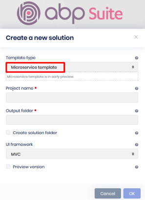

# Creating a New Microservice Solution

There are 2 ways of creating a new solution from the microservice startup template:

- ### ABP Suite

  Write `abp suite` command to your shell to open ABP Suite. Then click **Create a new solution** button on the home page. Choose **Microservice template** from the template type drop down.

  

* ### ABP CLI

  The following command creates a new microservice solution with the default UI option MVC and based the latest stable version. 

  ```bash
  abp new <solution name> -t microservice-pro -u mvc
  ```

  UI options:

  * #### MVC
    *  `abp new <solution name> -t microservice-pro -u mvc`

  * #### Angular
    *  `abp new <solution name> -t microservice-pro -u angular`

  * #### Blazor WASM
    *  `abp new <solution name> -t microservice-pro -u blazor`

  * #### Blazor Server
    *  `abp new <solution name> -t microservice-pro -u blazor-server`

  You can also add the following parameters:

  * `--preview`: creates a new solution with the latest preview version.
  * `-csf `: creates a new solution inside a new folder with the same solution name.
  * `--output-folder`: creates a new solution into the given path. 
  * `--version`: creates a new solution based on a specific version.

  

  Check out [ABP CLI documentation](https://docs.abp.io/en/abp/latest/CLI), for further information.
  
  

##### Examples:

* Create microservice Angular solution in a new folder with preview version:
  * `abp new Acme.BookStore -t microservice-pro -u angular --preview -csf` 
* Create microservice Blazor Server solution in the given output path within a new folder same as solution name
  * `abp new Acme.BookStore -t microservice-pro -u blazor-server --output-folder "C:\MyProjects\Stables\" -csf`


> Some options are not available for the microservice template.  Therefore you cannot change the default database provider `Entity Framework Core`.  Also `--separate-auth-server` parameter is ignored since it comes already with a separate Auth Server. 


## Next

* [Overall](index.md)
