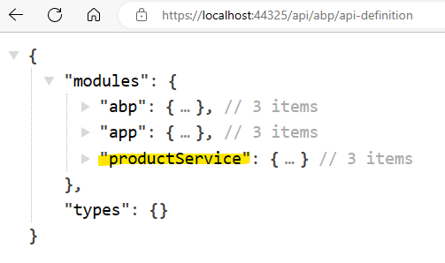
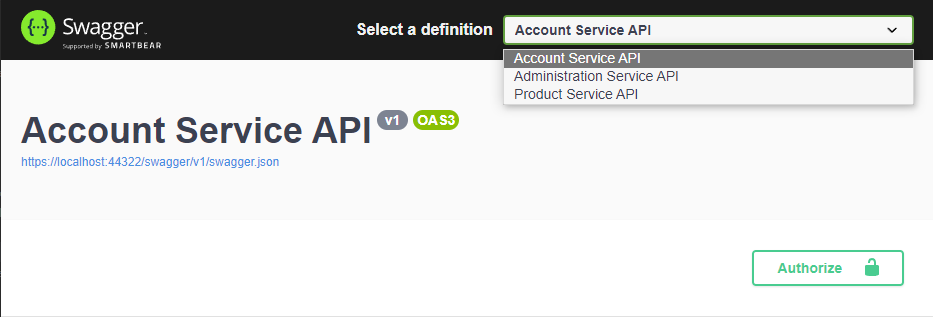

# Microservice Startup Template: API Gateways

API Gateways are used as single entry point to the microservices. ABP microservice startup template uses [YARP](https://microsoft.github.io/reverse-proxy/) library. For more, check out [YARP Documentations](https://microsoft.github.io/reverse-proxy/api/index.html).

There are 2 different gateways are presented in the microservice startup template;

- **Web Gateway** is located under *gateways/web* folder. This API Gateway uses BFF pattern and redirects requests from Web application (MVC/Agular/Blazor) to Authentication Server or microservices.
- **Public Web Gateway**  is located under *gateways/webpublic* folder. This API Gateway also uses BFF pattern and redirects requests from Public Web application to Authentication Server or microservices.

All gateways has their respected solutions created already and can be developed further when if required without opening the whole template solution. The following image shows the gateway highlighted in the overall solution diagram:


To compare microservice template to tiered application template: Gateway is an **API.Host** project that proxies all the requests to related microservices.  

All gateways depends on **SharedHostingGatewayModule** which references to [YARP.ReverseProxy](https://www.nuget.org/packages/Yarp.ReverseProxy) configures the default **YARP** configuration (see the [Shared Modules](infrastructure.md#hosting-gateways) section).

## Backend for Frontend Pattern (BFF)

While API Gateway provides a **single point of entry** to system, Backend for Frontend pattern defines **each client with an individual API**. The Microservice solution template uses BFF pattern thus each application has its own web gateway.


If you are planning to add your custom client (such as mobile application), it is recommended to add a new gateway for that specific client since each client's requests will probably be different.

## Client Proxies

When the back-office or public-web application makes a request to a microservice, the service location should be obtained on run-time ([Dynamic API Client Proxies](https://docs.abp.io/en/abp/latest/API/Dynamic-CSharp-API-Clients)) or on development time ([Static API Client Proxies](https://docs.abp.io/en/abp/latest/API/Static-CSharp-API-Clients)).

If you examine the `ProductServiceHttpApiClientModule` of the sample ProductService and [adding a new microservice](https://docs.abp.io/en/commercial/latest/startup-templates/microservice/add-microservice) template, they support [Static C# API Client Proxies](https://docs.abp.io/en/abp/latest/API/Static-CSharp-API-Clients) **by default**. 

If you want your new microservice to use [Dynamic API Client Proxies](https://docs.abp.io/en/abp/latest/API/Dynamic-CSharp-API-Clients), you need to add extra configurations.

**1- Update the HttpApiClientModule**: Change the `.AddStaticHttpClientProxies` method to `AddHttpClientProxies` in the `MicroServiceServiceHttpApiClientModule`.

After making this change, you may get an error:

```txt
[ERR] Could not found remote action for method: ...
at Volo.Abp.Http.Client.DynamicProxying.ApiDescriptionFinder.FindActionAsync(HttpClient client, String baseUrl, Type serviceType, MethodInfo method)
```

This error indicates that the **dynamic proxy couldn't find the related endpoint** in the api definition endpoint (/api/abp/api-definition) which is re-routed to AdministrationService.

**2- Update the gateway midware:** Use the midware below to remove the api definition endpoint from the routing list so that the microservice end-points can be found at the endpoint.

```csharp
...
app.UseAbpSerilogEnrichers();
// Add this mapping        
app.MapWhen( 
    ctx => ctx.Request.Path.ToString().StartsWith("/api/abp/api-definition") ||
           ctx.Request.Path.ToString().TrimEnd('/').Equals(""),
    app2 =>
    {
        app2.UseRouting();
        app2.UseConfiguredEndpoints();
    }
);

app.UseRewriter(new RewriteOptions()
    // Regex for "", "/" and "" (whitespace)
    .AddRedirect("^(|\\|\\s+)$", "/swagger"));
...
```

**3- Add Microservice.Http.Api dependency**: Add project reference of your `Microservice.Http.Api` and don't forget to add the module dependency on top of the `GatewayModule` class as well. Now you can see the dynamically generated api endpoint.



> **Note:** Using [Dynamic API Client Proxies](https://docs.abp.io/en/abp/latest/API/Dynamic-CSharp-API-Clients) in microservice solution creates **tightly coupling** between the gateway and the microservice Http.Api. Keep on mind that whenever you update your microservice Http.Api, you need to re-deploy the gateway. Also, this approach can only be used by .NET based gateways.

## Web Gateway

Web Gateway is used to connect the **Web** (back-office) application to microservices. This is done by setting this gateway as default [RemoteService](applications.md#remote-service-calls-web-gateway) in Web application appsettings.

### Module Configuration and Routing

As default, this gateway proxies each request from back-office application to related microservice and redirects the account related requests to AuthServer. YARP re-route configuration can be found in `yarp.json` file. This configuration is added by using **AddYarpJson** extension method in `Program.cs`. The re-routing configuration is as below:

- **Identity Service:** Uses dynamic proxy and re-routes 

  - `/api/identity/{everything}`
  - `/api/identity-server/{everything}`
  - `/api/account-admin/{everything}`

  to `localhost:44388` (IdentityService).

- **Administration Service:** Uses dynamic proxy and re-routes

  -  `/api/abp/{everything}`  [application configuration endpoint](https://docs.abp.io/en/abp/latest/API/Application-Configuration)
  - `/api/audit-logging/{everything}`
  - `/api/language-management/{everything}`
  - `/api/text-template-management/{everything}`
  - `/api/feature-management/{everything}`
  - `/api/permission-management/{everything}`
  - `/api/setting-management/{everything}`
  - `/api/lepton-theme-management/{everything}`

  to `localhost:44367` (AdministrationService).

- **Saas Service:** Uses dynamic proxy and re-routes

  -  `/api/saas/{everything}`
  -  `/api/payment/{everything}`
  -  `/api/payment-admin/{everything}`

   to `localhost:44381` (SaasService).

- **Product Service:** Uses static proxy and re-routes

  - `/api/product-service/{everything}`

   to `localhost:44361` (ProductService).

- **Account Service:** Uses dynamic proxy and re-routes

  -  `/api/account/{everything}` (login page etc requests)

  to `localhost:44322` (AuthServer).

### Swagger and Authorization Configuration

Web Gateway has swagger with openid-connect authorization configuration to make *authorization_code* interaction by default with AuthServer to be able to get authorized scopes:

```csharp
SwaggerConfigurationHelper
    .ConfigureWithOidc(
        context: context,
        authority: configuration["AuthServer:Authority"]!,
        scopes: new[] {
            /* Requested scopes for authorization code request and descriptions for swagger UI only */
            "AccountService", "IdentityService", "AdministrationService", "SaasService", "ProductService"
        },
        apiTitle: "Web Gateway API",
        discoveryEndpoint: configuration["AuthServer:MetadataAddress"]
    );
```

By default, Web Gateway makes requests to all API scopes that are already allowed when the `WebGateway_Swagger` client is being created in [AuthServer configuration](microservices#authserver-authorization). To be able to make the request, the required information is found under **AuthServer** section in `appsettings.json`:

```json
"AuthServer": {
  "Authority": "https://localhost:44322",
  "MetadataAddress": "https://localhost:44322",
  "RequireHttpsMetadata": "true",
  "SwaggerClientId": "WebGateway_Swagger"
},
```

The *MetadataAddress* is used when you have different discovery endpoint than the issuer. This is useful when you deploy your gateway on isolated network such as Kubernetes or Docker.

Each routed service is added to swagger definitions distinctively that uses the same `SwaggerClientId` and `SwaggerClientSecret` from appsettings.

```csharp
private static void ConfigureSwaggerUI(
    IProxyConfig proxyConfig,
    SwaggerUIOptions options,
    IConfiguration configuration)
{
    foreach (var cluster in proxyConfig.Clusters)
    {
        options.SwaggerEndpoint($"/swagger-json/{cluster.ClusterId}/swagger/v1/swagger.json",
            $"{cluster.ClusterId} API");
    }

    options.OAuthClientId(configuration["AuthServer:SwaggerClientId"]);
    options.OAuthScopes(
        "AdministrationService",
        "AccountService",
        "IdentityService",
        "SaasService",
        "ProductService"
    );
}
```

 This will allow each re-routed microservice to be selected from definition and authorized individually by using the same `WebGateway_Swagger` client.


> If you add a new microservice and want to use it in your Web application; you need to [update this gateway configuration](add-microservice.md#updating gateways) and [AuthServer configuration](gateways.md#authserver-configuration).

## Public Web Gateway

Public Web Gateway is used to connect the **Public  Web** (landing page) application to microservices. This is done by setting this gateway as default [RemoteService](applications.md#remote-service-calls-web-gateway) in Public Web application appsettings. ([See here](applications.md#remote-service-calls-publicweb-gateway))

### Module Configuration and Routing

By default, this gateway proxy each request landing page application to a related microservice and redirects the account related requests to AuthServer. YARP re-route configuration can be found in `yarp.json` file. This configuration is added by using **AddYarpJson** extension method in `Program.cs`. The re-routing configuration is as below:


- **Account Service:** Uses dynamic proxy and re-routes

  -  `/api/account/{everything}` (login page etc requests)

  to `localhost:44322` (Authentication Server).

- **Administration Service:** Uses dynamic proxy and re-routes

  - `/api/abp/{everything}`  [application configuration endpoint](https://docs.abp.io/en/abp/latest/API/Application-Configuration)


  to `localhost:44367` (AdministrationService).

- **Product Service:** Uses static proxy and re-routes

  - `/api/product-service/{everything}`

   to `localhost:44361` (ProductService).  


### Authorization Configuration

Public Web Gateway has swagger with openid-connect authorization configuration to make *authorization_code* interaction by default AuthServer to be able to get authorized scopes:

```csharp
SwaggerConfigurationHelper
    .ConfigureWithOidc(
        context: context,
        authority: configuration["AuthServer:Authority"]!,
        scopes: new[] {
            /* Requested scopes for authorization code request and descriptions for swagger UI only */
            "AccountService", "AdministrationService", "ProductService"
        },
        apiTitle: "Public Web Gateway API",
        discoveryEndpoint: configuration["AuthServer:MetadataAddress"]
    );
```

By default, PublicWeb Gateway makes requests to only **ProductService** scope that is already allowed when the `PublicWebGateway_Swagger` client is being created in [AuthServer configuration](microservices#authserver-authorization). To be able to make the request, the required information is found under **AuthServer** section in `appsettings.json`:

```json
"AuthServer": {
  "Authority": "https://localhost:44322",
  "MetadataAddress": "https://localhost:44322",
  "RequireHttpsMetadata": "true",
  "SwaggerClientId": "WebGateway_Swagger"
},
```

The *MetadataAddress* is used when you have different discovery endpoint than the issuer. This is useful when you deploy your gateway on isolated network such as Kubernetes or Docker.

Each routed service is added to swagger definitions distinctively that uses the same `SwaggerClientId` and `SwaggerClientSecret` from appsettings.

```csharp
private static void ConfigureSwaggerUI(
    IProxyConfig proxyConfig,
    SwaggerUIOptions options,
    IConfiguration configuration)
{
    foreach (var cluster in proxyConfig.Clusters)
    {
        options.SwaggerEndpoint($"/swagger-json/{cluster.ClusterId}/swagger/v1/swagger.json",
            $"{cluster.ClusterId} API");
    }

    options.OAuthClientId(configuration["AuthServer:SwaggerClientId"]);
    options.OAuthScopes(
        "AdministrationService",
        "AccountService",
        "ProductService"
    );
}
```

 This will allow each re-routed microservice to be selected from the definition and authorized individually by using the same `WebGateway_Swagger` client.



> If you add a new microservice and want to use it in your PublicWeb application; you need to [update this gateway configuration](add-microservice.md#updating-gateways) and [AuthServer configuration](gateways.md#authserver-configuration).

## Next

- [Microservice Startup Template: Infrastructure](infrastructure.md)