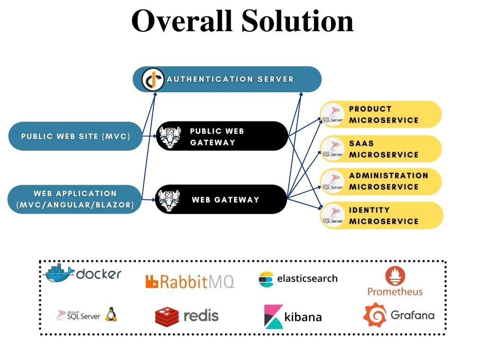

# Microservice Startup Template

The Microservice Startup Template is a generic solution to start a new microservice solution. While we accept that every microservice solution will be different and every system has its own design requirements and trade-offs, we believe such a startup solution is a useful starting point for most solutions.

## Creating a New Microservice Solution

Read the [creating a new microservice solution document](create-new-microservice.md) to understand how to create your new microservice solution.

## Overall Diagram

This section introduces the solution structure and briefly explains the solution components. The following diagram is an overview of the applications, gateways, services, databases, and other components;

*Figure: Overall Diagram of the Solution (not all associations are shown, for the sake of simplicity)*

* The **Authentication Server** is a web application serves as openid-provider that is used as a single sign-on authentication server. It hosts the login, register, forgot password, two-factor authentication, profile management... pages, OAuth endpoints and authentication-related APIs. All applications and services use this application as a central authority for authentication.
* There are two **web applications** in the solution (you can add more yourself);
  * The **Web Application** is the main UI of the system. It uses the *Authentication Server* to make users login to the application. Then it uses the *Web Gateway* to access  the HTTP APIs. You mostly develop your UI here. Based on your preference, it can be an **MVC (Razor Pages)**, **Angular** or **Blazor** application.
  * The **Public Website** is a second web application that can be used to develop your landing page for the application. If you don't need it, you can remove it. It uses the *Authentication Server* to make users login to the application. Then it uses the *Public Web Gateway* to access the HTTP APIs.
* There are two **API gateways** in the solution (you can add more if you need);
  * The **Web Gateway** is a BFF (Backend for Frontend) that provides the necessary HTTP APIs to the *Web Application*.
  * The **Public Web Gateway** is a BFF (Backend for Frontend) that provides the necessary HTTP APIs to the *Public Web Application*.
* There are **four microservices** coming with the solution (you can split existing ones and add new ones);
  * **Identity Microservice** is used to manage users, roles, clients, resources... in the system.
  * **SaaS Microservice** is used to manage tenants and editions for a multi-tenant system. If your system is not multi-tenant, you can remove this service and its database from the solution.
  * **Administration Microservice** is mostly related to infrastructure requirements like permissions, settings, audit logs, dynamic localization and BLOB storing. This service and the related database can be split based on your design decisions.
  * **Product Microservice** is an example microservices that can be investigated to develop your own microservices.
* There are **four databases**, each is owned by the related microservice. Databases are SQL Server with EF Core integrated in the applications. You can [switch to another RDBMS](https://docs.abp.io/en/abp/latest/Entity-Framework-Core-Other-DBMS) or [MongoDB](https://docs.abp.io/en/abp/latest/MongoDB) for any of them. Administration and SaaS databases are used by other services since they contains cross-cutting style data (like permissions and audit logs) that is needed by all services. The reasons behind this design decision will be discussed and alternative implementations will be explained.
* There are some infrastructure services are configured in the solution (they are configured to run with docker-compose and also with [Tye](https://github.com/dotnet/tye));
  * **Redis** is used as a distributed cache server.
  * **RabbitMQ** is used as a distributed event/message bus.
  * **ElasticSearch** is used as a central point to write application logs.
  * **Kibana** is used to visualize the logs in the Elasticsearch database.
  * **Grafana** is used to compose observability dashboards.
  * **Prometheus** is used for event monitoring and alerting.
  * **Sql-Server-Linux** is used for running the database in a container. The default exposed port is 1434.

## Next

* [Get started with the microservice startup template](get-started.md)
